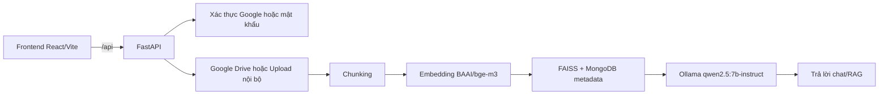
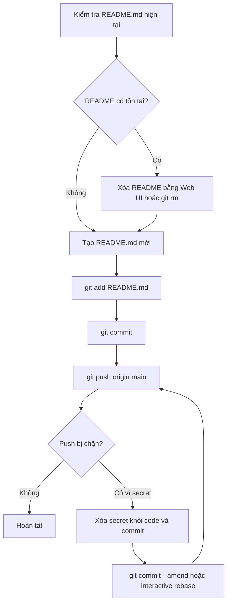

# Quy trình repo chatbot

## Tóm tắt điều hành

Dựa trên bản trích xuất repo đã có trong phiên làm việc, `quanmp2811/chatbot` là một dự án **trợ lý ảo doanh nghiệp** theo mô hình full-stack, với **backend FastAPI/Python** và **frontend React/Vite**, tích hợp **Google OAuth**, **đồng bộ Google Drive**, **upload tài liệu nội bộ**, **RAG** bằng **FAISS + embedding BAAI/bge-m3**, sinh câu trả lời qua **Ollama**, và có thêm các module **quản trị công ty**, **thanh toán VNPAY/MoMo**, cùng một số tác vụ nền như reminder và đồng bộ định kỳ. Bản quét cũng chỉ ra các tệp cốt lõi như `backend/app/main.py`, `backend/app/core/config.py`, `backend/app/db/mongo.py`, `frontend/package.json`, `frontend/vite.config.js`, `frontend/.env`, `frontend/.env.production`, `frontend/src/main.jsx`, `backend/start-dev.ps1`, `backend/run_backend.bat`, `backend/start.sh`, và `.gitignore`. fileciteturn0file0

Cùng bản quét đó ghi nhận rằng tại thời điểm rà soát, repo **chưa có README mô tả đầy đủ**, **chưa thấy `LICENSE`**, **chưa thấy `Dockerfile`/`docker-compose.yml`**, **chưa thấy `pyproject.toml`**, và cũng **chưa thấy `backend/.env.example` hoặc `frontend/.env.example`**. Vì vậy, README bên dưới được viết theo hướng **bám sát những gì repo đang có**, đồng thời **đánh dấu rõ các chỗ “chưa chỉ rõ trong repo”** hoặc **“khuyến nghị bổ sung”** thay vì tự bịa thông tin. fileciteturn0file0

## README.md đề xuất

README dưới đây được dựng lại từ cấu trúc và cấu hình đã trích xuất trong repo: backend chạy bằng `uvicorn app.main:app`, frontend dùng Vite/React với các script `dev/build/preview/lint`, backend đọc biến môi trường từ `config.py`, MongoDB hiện đang hardcode local, frontend có `VITE_API_URL` cho local và production, `frontend/src/main.jsx` đang hardcode Google Client ID, `.gitignore` hiện đã bỏ qua `.env`, `google_oauth.json`, `venv/.venv`, `node_modules`, `*.log`, `*.tmp` và file tạm Office. Vì repo chưa có `.env.example`, phần biến môi trường trong README này là **mẫu khuyến nghị** dựa trên mã nguồn đã có. fileciteturn0file0

```markdown
# Chatbot doanh nghiệp

Ứng dụng trợ lý ảo doanh nghiệp theo kiến trúc full-stack, gồm:

- **Backend**: FastAPI + MongoDB + FAISS + Ollama
- **Frontend**: React + Vite + Ant Design
- **Tính năng chính**:
  - Đăng nhập Google / đăng nhập bằng mật khẩu
  - Quản lý công ty, người dùng, admin, developer
  - Kết nối Google Drive và đồng bộ tài liệu
  - Upload tài liệu nội bộ
  - Chat theo ngữ cảnh doanh nghiệp bằng RAG
  - Thanh toán gói dịch vụ qua VNPAY / MoMo
  - Nhắc hạn và đồng bộ nền theo lịch

> Lưu ý:
> - README này được viết theo mã nguồn hiện có trong repo.
> - Một số mục như `LICENSE`, `Dockerfile`, `.env.example`, version tối thiểu của Node/Mongo/Ollama **chưa được repo chỉ rõ**.
> - Nếu bạn triển khai production, nên bổ sung thêm `.env.example`, `Dockerfile`, tài liệu triển khai và license.

## Kiến trúc tổng quát



## Cấu trúc dự án

| Path | Vai trò | Lệnh liên quan |
|---|---|---|
| `backend/` | Mã nguồn backend FastAPI, AI services, auth, company, payment | `cd backend && uvicorn app.main:app --reload --port 8000` |
| `frontend/` | Mã nguồn frontend React/Vite | `cd frontend && npm run dev` |
| `backend/app/main.py` | Entry point FastAPI, CORS, scheduler, mount router `/` và `/api` | `uvicorn app.main:app --reload` |
| `backend/app/core/config.py` | Định nghĩa biến môi trường và cấu hình ứng dụng | Không chạy trực tiếp |
| `backend/app/db/mongo.py` | Kết nối MongoDB, DB name, index collection | Khởi động cùng backend |
| `backend/app/modules/auth/router.py` | Auth Google, auth mật khẩu, refresh token, email verification, reset password | Gọi qua API backend |
| `backend/app/modules/companies/router.py` | Tạo công ty, trial, kết nối Google Drive, OAuth exchange | Gọi qua API backend |
| `backend/app/modules/payments/router.py` | Gói cước, thanh toán, callback VNPAY, IPN MoMo | Gọi qua API backend |
| `backend/app/routers/chats.py` | Tạo chat, gửi message, background chat, stop message | Gọi qua API backend |
| `backend/app/routers/upload.py` | Upload file nội bộ và vector hóa | Gọi qua API backend |
| `backend/start-dev.ps1` | Script dev Windows, kiểm tra Ollama và chạy Uvicorn | `powershell -ExecutionPolicy Bypass -File .\backend\start-dev.ps1` |
| `backend/run_backend.bat` | Script batch Windows chạy backend | `.\backend\run_backend.bat` |
| `backend/start.sh` | Script shell Linux/macOS | `bash ./backend/start.sh` |
| `frontend/package.json` | Script frontend (`dev`, `build`, `preview`, `lint`) | `npm run dev`, `npm run build` |
| `frontend/vite.config.js` | Cấu hình Vite và proxy `/api` | Tự dùng khi `npm run dev` |
| `frontend/.env` | API URL local | Không chạy trực tiếp |
| `frontend/.env.production` | API URL production | Tự dùng khi build |
| `frontend/src/main.jsx` | Bootstrap frontend, provider Google OAuth | `npm run dev` |
| `frontend/src/App.jsx` | Khai báo route giao diện theo vai trò | `npm run dev` |

## Yêu cầu hệ thống

### Bắt buộc

- Python + `pip`
- Virtual environment (`venv` / `.venv`)
- Node.js + `npm`
- MongoDB local
- Ollama chạy local

### Tùy chọn nhưng cần nếu dùng đầy đủ tính năng

- Google OAuth / Google Drive API
- SMTP để gửi email xác thực / quên mật khẩu
- VNPAY
- MoMo

### Phiên bản

- Repo có `run_backend.bat` gợi ý dùng **Python 3.10**
- Version tối thiểu của **Node.js**, **MongoDB** và **Ollama**: **chưa được repo chỉ rõ**

## Cài đặt

### Clone project

```bash
git clone https://github.com/quanmp2811/chatbot.git
cd chatbot
```

### Cài backend

#### Windows PowerShell

```powershell
cd backend
py -3.10 -m venv .venv
.\.venv\Scripts\Activate.ps1
python -m pip install --upgrade pip
pip install -r requirements.txt
cd ..
```

#### Linux / macOS

```bash
cd backend
python3 -m venv .venv
source .venv/bin/activate
python -m pip install --upgrade pip
pip install -r requirements.txt
cd ..
```

### Cài frontend

```bash
cd frontend
npm install
cd ..
```

## Biến môi trường

> Repo hiện **chưa có** `backend/.env.example` và `frontend/.env.example` trong phần rà soát đã dùng để viết README này.  
> Dưới đây là **mẫu đề xuất** dựa trên `backend/app/core/config.py`, `frontend/.env`, `frontend/.env.production`, `frontend/src/main.jsx`, và `backend/app/db/mongo.py`.

### Backend: `backend/.env`

```env
# Google OAuth / Drive
GOOGLE_CLIENT_ID=your-google-client-id.apps.googleusercontent.com
GOOGLE_CLIENT_SECRET=your-google-client-secret
GOOGLE_REDIRECT_URI=http://localhost:5173/drive-callback

# JWT / ứng dụng
JWT_SECRET_KEY=replace-with-a-long-random-secret
DEVELOPER_EMAILS=developer@example.com
FRONTEND_LOGIN_URL=http://localhost:5173/login

# Đồng bộ / AI
SYNC_INTERVAL_MINUTES=1
OLLAMA_URL=http://localhost:11434/api/generate
OLLAMA_MODEL=qwen2.5:7b-instruct
OLLAMA_TIMEOUT_SECONDS=90

# SMTP / email
SMTP_HOST=smtp.example.com
SMTP_PORT=587
SMTP_USERNAME=your_smtp_user
SMTP_PASSWORD=your_smtp_password
SMTP_FROM_EMAIL=no-reply@example.com
SMTP_FROM_NAME=Tro ly ao doanh nghiep
SMTP_USE_TLS=true
EMAIL_CODE_EXPIRE_MINUTES=10
EMAIL_DEBUG_RETURN_CODE=false

# VNPAY
VNPAY_TMN_CODE=your_tmn_code
VNPAY_HASH_SECRET=your_hash_secret
VNPAY_URL=https://sandbox.vnpayment.vn/paymentv2/vpcpay.html
VNPAY_RETURN_URL=https://your-backend-domain/payment/vnpay-return

# MoMo
MOMO_PARTNER_CODE=your_partner_code
MOMO_ACCESS_KEY=your_access_key
MOMO_SECRET_KEY=your_secret_key
MOMO_ENDPOINT=https://test-payment.momo.vn/v2/gateway/api/create
MOMO_RETURN_URL=https://your-frontend-domain/payment-result
MOMO_IPN_URL=https://your-backend-domain/payment/momo-ipn

# Khuyến nghị thêm để refactor cấu hình DB
# Lưu ý: phần rà soát repo cho thấy mongo hiện đang hardcode local trong app/db/mongo.py
MONGO_URI=mongodb://localhost:27017
MONGO_DB_NAME=tro_ly_ao_dn
```

### Frontend: `frontend/.env`

```env
VITE_API_URL=http://localhost:8000

# Khuyến nghị thêm:
# Hiện phần rà soát repo cho thấy Google Client ID đang hardcode trong frontend/src/main.jsx
VITE_GOOGLE_CLIENT_ID=your-google-client-id.apps.googleusercontent.com
```

### Frontend production: `frontend/.env.production`

```env
VITE_API_URL=https://api.trolyaodoanhnghiep.io.vn
```

## Chạy dự án

### Chạy development

#### Backend

```bash
cd backend
# Windows: .\.venv\Scripts\Activate.ps1
# Linux/macOS: source .venv/bin/activate
uvicorn app.main:app --reload --host 127.0.0.1 --port 8000
```

Hoặc trên Windows dùng script của repo:

```powershell
cd backend
.\.venv\Scripts\Activate.ps1
powershell -ExecutionPolicy Bypass -File .\start-dev.ps1
```

> Lưu ý:
> - `backend/run_backend.bat` hiện trỏ tới **root `.venv`** chứ không phải `backend/.venv`. Nếu dùng file `.bat`, hãy kiểm tra lại biến `PYTHON_EXE`.
> - `backend/start.sh` trong phần rà soát có dấu hiệu dùng `uvicorn main:app`; nếu lỗi import, hãy dùng `uvicorn app.main:app`.

#### Frontend

```bash
cd frontend
npm run dev
```

### Build frontend

```bash
cd frontend
npm run build
```

### Preview bản build frontend

```bash
cd frontend
npm run preview
```

### Production tối thiểu

#### Backend

```bash
cd backend
# kích hoạt venv
uvicorn app.main:app --host 0.0.0.0 --port 8000
```

#### Frontend

```bash
cd frontend
npm run build
```

> Cách serve thư mục build frontend và kiến trúc deploy production đầy đủ **chưa được repo chỉ rõ**.

## Sự cố thường gặp

### Bị push nhầm `.venv`, `venv`, `node_modules`

```bash
git rm -r --cached backend/.venv backend/venv .venv venv node_modules
git commit -m "chore: remove local environments from git"
```

### Push bị chặn do secret scanning / push protection

- Không commit:
  - `backend/.env`
  - `backend/app/core/google_oauth.json`
  - token, client secret, key thanh toán
- Chuyển toàn bộ secret sang `.env`
- Thêm `.env.example`
- Nếu secret đã nằm trong commit cũ, cần sửa commit cũ hoặc làm sạch lịch sử

### `start.sh` bị lỗi `main:app`

Chạy thủ công:

```bash
cd backend
uvicorn app.main:app --host 0.0.0.0 --port 8000
```

### Backend lỗi không kết nối Ollama

Kiểm tra:

- Ollama đang chạy
- đúng URL `http://localhost:11434/api/generate`
- model `qwen2.5:7b-instruct` đã có sẵn

### Backend lỗi MongoDB

Phần rà soát repo cho thấy MongoDB đang trỏ local. Hãy chắc chắn MongoDB chạy ở:

```text
mongodb://localhost:27017
```

và DB name đúng:

```text
tro_ly_ao_dn
```

### Frontend lỗi gọi API

Kiểm tra:

- `frontend/.env`
- `frontend/.env.production`
- `VITE_API_URL`
- proxy trong `frontend/vite.config.js`
- backend đang chạy ở cổng `8000`

## `.gitignore` khuyến nghị

Repo hiện đã ignore một phần các file nhạy cảm và thư mục môi trường. Bạn nên mở rộng thêm như sau:

```gitignore
# Python
backend/.venv/
backend/venv/
.venv/
venv/
__pycache__/
*.py[cod]
.pytest_cache/

# Node
frontend/node_modules/
node_modules/
dist/
coverage/

# Secrets
backend/.env
frontend/.env.local
backend/app/core/google_oauth.json

# Logs / temp
backend/logs/
*.log
*.tmp
~$*

# Runtime / artifacts
uploads/
backend/data/
temp_*
```

## Đóng góp

1. Tạo branch riêng:
   ```bash
   git checkout -b feature/ten-tinh-nang
   ```
2. Commit nhỏ, rõ nghĩa
3. Không commit secret, `.venv`, `node_modules`, file lớn
4. Push branch và tạo Pull Request

## Giấy phép

Hiện phần rà soát repo **chưa thấy file `LICENSE`**.  
Nếu dự án có ý định public lâu dài, nên bổ sung license rõ ràng như MIT, Apache-2.0 hoặc license nội bộ phù hợp.

## Liên hệ

- Chủ repo GitHub: `quanmp2811`
- Nên liên hệ qua:
  - GitHub Issues
  - Pull Request
  - GitHub profile của chủ repo
```

Trong README trên, các mục như `.env.example`, `MONGO_URI`, `MONGO_DB_NAME`, `VITE_GOOGLE_CLIENT_ID`, chuẩn hóa `.gitignore`, và hướng dẫn production/Docker được ghi là **khuyến nghị** vì phần trích xuất repo hiện có chưa cho thấy các file hoặc quy ước này tồn tại sẵn trong repository. fileciteturn0file0

## Cách xóa README hiện tại và đẩy README mới

Bản quét repo được dùng để viết báo cáo này từng ghi nhận repo **chưa có README mô tả đầy đủ** tại thời điểm rà soát; vì vậy nếu hiện tại repo của bạn **đã có `README.md`**, hãy dùng quy trình “xóa rồi tạo mới” bên dưới. Nếu repo hiện **chưa có README**, bạn chỉ cần **bỏ qua bước xóa** và đi thẳng tới bước tạo `README.md` mới. fileciteturn0file0

GitHub Docs xác nhận rằng người có quyền ghi có thể xóa file trực tiếp trên giao diện web bằng menu **Delete file**; đồng thời docs cũng nhấn mạnh rằng nếu file chứa dữ liệu nhạy cảm thì việc xóa file ở branch hiện tại **không xóa nó khỏi lịch sử Git**. Với push protection, GitHub sẽ **chặn push khi phát hiện secret**, và cách chuẩn là **gỡ secret khỏi tất cả commit liên quan**; nếu secret chỉ mới vào commit cuối, docs hướng dẫn sửa code rồi chạy `git commit --amend --all`, sau đó `git push` lại. citeturn6view0turn6view1turn6view3

### Thay README bằng GitHub Web UI

Nếu `README.md` đang tồn tại ở root repo:

1. Mở repo và vào file `README.md`.
2. Ở góc trên bên phải của file, bấm menu ba chấm và chọn **Delete file**.
3. Điền commit message, rồi **Commit changes** hoặc **Propose changes**. citeturn6view0

Sau đó tạo README mới:

1. Ở root repo, chọn **Add file** → **Create new file**.
2. Đặt tên file là `README.md`.
3. Dán nội dung README mới ở trên.
4. Commit thay đổi vào `main` hoặc tạo branch rồi mở PR.

Nếu repo đang bị chặn bởi push protection vì secret, đừng chọn bypass nếu đó là secret thật; hãy chuyển secret ra khỏi repo trước. GitHub Docs nói rõ hướng ưu tiên là **remove secret from all commits it appears in**. citeturn6view1turn5view0

### Thay README bằng Git CLI

Nếu README cũ **đang được Git theo dõi**:

```bash
git pull origin main --rebase

git rm README.md
# nếu bạn chỉ muốn thay nội dung mà không cần xóa-history cấp branch hiện tại:
# có thể bỏ qua "git rm", rồi chỉ cần sửa file README.md

# tạo file README.md mới và dán nội dung mới
git add README.md

git commit -m "docs(readme): replace README in Vietnamese"
git push origin main
```

Nếu repo **chưa có README**:

```bash
git pull origin main --rebase

# tạo README.md mới
git add README.md
git commit -m "docs(readme): add Vietnamese README"
git push origin main
```

Nếu dùng PowerShell để xóa file local trước khi tạo lại:

```powershell
Remove-Item README.md
```

Nếu push bị chặn vì secret trong commit cuối, theo docs GitHub, bạn sửa file rồi chạy:

```bash
git commit --amend --all
git push origin main
```

Nếu secret nằm ở commit cũ hơn, docs hướng dẫn dùng interactive rebase từ commit sớm nhất chứa secret. Nếu cần xóa hẳn một file nhạy cảm khỏi toàn bộ lịch sử, GitHub Docs hướng dẫn `git-filter-repo --sensitive-data-removal --invert-paths --path PATH-TO-YOUR-FILE-WITH-SENSITIVE-DATA`. citeturn6view1turn6view3



## Gợi ý sửa lỗi font ở frontend

Phần trích xuất repo cho thấy frontend đang dùng **React + Vite + Ant Design**, có `frontend/package.json`, `frontend/vite.config.js`, `frontend/src/main.jsx`, `frontend/src/App.jsx`, `frontend/.env`, và `frontend/.env.production`, nhưng **không thấy trong bản trích xuất một cấu hình typography hoặc font-loading chuyên biệt nào**. Vì vậy, phần này là **chẩn đoán suy luận** theo stack hiện có, không phải khẳng định rằng repo chắc chắn đang sai ở đúng chỗ nào. fileciteturn0file0

Nguyên nhân thường gặp nhất với stack kiểu này là một trong bốn nhóm sau: **font-family bị override bởi CSS global hoặc Ant Design**, **font file không load được**, **file mã nguồn/CSS không ở UTF-8**, hoặc **cache trình duyệt/Vite giữ lại CSS cũ**. Ngoài ra, vì repo đang có nhiều điều chỉnh quanh `.env`, production URL và Google OAuth provider ở `frontend/src/main.jsx`, cũng nên kiểm tra xem build production có đang dùng bundle cũ hoặc đường dẫn asset/font sai hay không. fileciteturn0file0

### Bước kiểm tra và sửa theo thứ tự

Trước hết, nếu repo giữ cấu trúc Vite chuẩn, hãy kiểm tra `frontend/index.html` và bảo đảm có:

```html
<meta charset="UTF-8" />
```

Sau đó mở các file CSS/global theme mà bạn đang dùng, thường là `frontend/src/index.css`, `frontend/src/App.css`, hoặc file theme Ant Design nếu có, rồi chuẩn hóa font stack cho các thành phần chính:

```css
html, body, #root,
.ant-typography, .ant-btn, .ant-input, .ant-select, .ant-menu {
  font-family: Inter, "Noto Sans", "Segoe UI", Roboto, Arial, sans-serif;
}
```

Nếu bạn dùng font tự host, hãy kiểm tra lại `@font-face`, đường dẫn font, và nơi import CSS. Ví dụ:

```css
@font-face {
  font-family: "Inter";
  src: url("/fonts/Inter-VariableFont.ttf") format("truetype");
  font-display: swap;
}

html, body, #root {
  font-family: "Inter", "Noto Sans", sans-serif;
}
```

Nếu font nằm trong `frontend/public/fonts/`, hãy chắc rằng đường dẫn là `/fonts/...`. Nếu font nằm trong `frontend/src/assets/fonts/`, hãy import CSS hoặc font file đúng chỗ từ `frontend/src/main.jsx`.

Tiếp theo, mở DevTools của trình duyệt:

1. Tab **Network**: lọc theo `font` để xem có file nào `404` hay không.
2. Tab **Elements** / **Computed**: kiểm tra phần tử bị lỗi đang nhận `font-family` nào.
3. Tab **Application** hoặc hard refresh: xóa cache, Service Worker và local cache nếu có.

Nếu nghi do cache Vite hoặc build cũ, xóa cache local rồi chạy lại:

```bash
cd frontend
rm -rf node_modules/.vite dist
npm run dev
```

Trên PowerShell:

```powershell
Remove-Item -Recurse -Force .\frontend\node_modules\.vite, .\frontend\dist -ErrorAction SilentlyContinue
cd frontend
npm run dev
```

Nếu chữ tiếng Việt bị “vỡ dấu” hoặc xuất hiện ký tự lạ, hãy kiểm tra encoding của file `.jsx`, `.js`, `.css`, `.html` trong editor và bắt buộc lưu thành **UTF-8**. Nếu dữ liệu từ API về đã sai ngay từ backend, khi đó lỗi không còn là “font” nữa mà là “encoding dữ liệu”; cần rà lại chỗ tạo/chuyển nội dung ở backend và bảo đảm dữ liệu được lưu/trả về theo UTF-8.

### Cách sửa khuyến nghị cho repo này

Với repo hiện tại, phương án an toàn nhất là:

1. Thêm hoặc xác nhận `<meta charset="UTF-8" />` ở `frontend/index.html`.
2. Tạo hoặc chỉnh file global CSS để ép font stack thống nhất cho `html`, `body`, `#root`, và các selector `.ant-*`.
3. Nếu đang dùng Google Fonts hoặc font riêng, chuyển sang tự host hoặc import rõ ràng ở đúng entrypoint.
4. Xóa cache trình duyệt + cache Vite.
5. Rebuild lại frontend bằng `npm run build` và kiểm tra production. fileciteturn0file0

## Bảng tệp chính, checklist chạy local và commit mẫu

Bảng dưới đây rút gọn các path quan trọng nhất từ phần repo đã rà soát, kèm mục đích và lệnh chạy tương ứng. Nó hữu ích khi bạn vừa thay README vừa dọn lại quy trình khởi động dự án. fileciteturn0file0

| Path | Mục đích | Lệnh nên dùng |
|---|---|---|
| `backend/app/main.py` | Entry point FastAPI, CORS, scheduler, mount `/api` | `uvicorn app.main:app --reload --port 8000` |
| `backend/app/core/config.py` | Đọc biến môi trường: OAuth, JWT, Ollama, SMTP, VNPAY, MoMo | Không chạy trực tiếp |
| `backend/app/db/mongo.py` | Kết nối MongoDB local và tạo index | Chạy cùng backend |
| `backend/start-dev.ps1` | Chạy backend dev trên Windows, kiểm tra Ollama | `powershell -ExecutionPolicy Bypass -File .\backend\start-dev.ps1` |
| `backend/run_backend.bat` | Script batch dev trên Windows | `.\backend\run_backend.bat` |
| `backend/start.sh` | Helper script Linux/macOS | `bash ./backend/start.sh` |
| `frontend/package.json` | Script `dev`, `build`, `preview`, `lint` | `npm run dev`, `npm run build` |
| `frontend/vite.config.js` | Proxy `/api` cho môi trường dev | `npm run dev` |
| `frontend/.env` | API URL local | Không chạy trực tiếp |
| `frontend/.env.production` | API URL production | Dùng khi build |
| `frontend/src/main.jsx` | Bootstrap app và Google OAuth provider | `npm run dev` |
| `.gitignore` | Ignore secrets, venv, node_modules, temp/log | Cập nhật khi cần |

### Checklist thao tác nên chạy ở máy local

```bash
# 1) cập nhật branch chính
git pull origin main --rebase

# 2) tạo / thay README.md
#   - dán nội dung README mới

# 3) khuyến nghị tạo file env mẫu nếu repo chưa có
# touch backend/.env.example
# touch frontend/.env.example

# 4) cập nhật .gitignore nếu chưa đủ
git add README.md .gitignore

# 5) nếu có tạo file env mẫu
git add backend/.env.example frontend/.env.example

# 6) commit
git commit -m "docs(readme): replace README in Vietnamese"

# 7) push
git push origin main
```

Nếu bạn từng lỡ add `.venv`, `venv`, hoặc `node_modules`, hãy dọn index trước khi push:

```bash
git rm -r --cached backend/.venv backend/venv .venv venv node_modules
git commit -m "chore: remove local envs and node_modules from git"
```

### Mẫu changelog ngắn

```text
Changelog:
- thay toàn bộ README.md bằng bản tiếng Việt theo cấu trúc repo hiện tại
- bổ sung hướng dẫn backend/frontend, biến môi trường, build và production
- thêm mục khắc phục .venv, node_modules, large files và push protection
- đề xuất .gitignore và .env.example để tránh lộ secret
```

### Mẫu commit message

```text
docs(readme): thay README tiếng Việt và bổ sung hướng dẫn cài đặt
```

Hoặc chi tiết hơn:

```text
docs(readme): replace README in Vietnamese, add env/setup/troubleshooting
```

## Tài liệu GitHub nên lưu lại

Có bốn tài liệu GitHub bạn nên giữ để xử lý đúng các lỗi đã gặp khi đẩy repo này lên. Thứ nhất là tài liệu về **push protection từ command line**, trong đó GitHub nêu rõ rằng khi push bị chặn vì secret, bạn nên **remove secret from all commits it appears in**; nếu secret ở commit cuối thì sửa rồi dùng `git commit --amend --all`, còn nếu secret nằm ở commit cũ hơn thì dùng interactive rebase. citeturn4view0turn6view1

Thứ hai là tài liệu về **deleting files in a repository**, giải thích cách xóa file bằng GitHub Web UI qua menu **Delete file**, đồng thời nhắc rằng nếu file chứa dữ liệu nhạy cảm thì việc xóa file ở nhánh hiện tại **không đủ để xóa dấu vết trong lịch sử Git**. citeturn4view1turn6view0

Thứ ba là tài liệu về **large files on GitHub**. GitHub ghi rõ rằng file trên **50 MiB** sẽ bị Git cảnh báo, file trên **100 MiB** sẽ bị GitHub chặn, và nếu buộc phải quản lý file vượt ngưỡng đó thì phải dùng **Git LFS**; ngoài ra khi upload bằng trình duyệt, mỗi file không được vượt quá **25 MiB**. Điều này giải thích chính xác vì sao các thư mục như `.venv`, `node_modules`, hoặc binary/model lớn không nên commit vào repo. citeturn4view2turn6view2

Thứ tư là tài liệu về **removing sensitive data from a repository**. Nếu secret đã đi vào lịch sử Git và bạn cần xóa sạch hoàn toàn, GitHub hướng dẫn dùng `git-filter-repo --sensitive-data-removal --invert-paths --path ...`, rồi thực hiện thêm các bước hậu xử lý phù hợp. Các docs này cũng lưu ý rằng việc rewrite history có thể ảnh hưởng pull request cũ, fork, và những người đang làm việc chung trên repo. citeturn4view3turn6view3

Tóm lại, hướng an toàn nhất cho repo này là: **không đẩy `.env`, `google_oauth.json`, `.venv`, `node_modules`, file temp, file log và file nhị phân lớn**; **thêm `.env.example`** thay vì secret thật; **thay README bằng commit tài liệu riêng**; và nếu GitHub chặn vì secret thì **xóa secret khỏi commit**, không nên “allow” một cách bừa bãi đối với khóa thật. Những khuyến nghị đó bám trực tiếp vào cả repo scan trong phiên làm việc lẫn tài liệu GitHub chính thức. fileciteturn0file0 citeturn6view1turn6view2turn6view3
