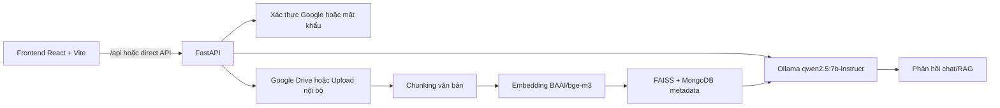

## Tóm tắt điều hành

Đây là một dự án **trợ lý ảo doanh nghiệp** theo kiến trúc full-stack, với **backend Python/FastAPI** và **frontend React/Vite**. Từ mã nguồn công khai hiện có, dự án không chỉ cung cấp chat thông thường mà còn tích hợp **Google OAuth**, **đồng bộ Google Drive**, **upload tài liệu nội bộ**, **RAG (Retrieval-Augmented Generation)** bằng **FAISS + embedding BAAI/bge-m3**, và sinh câu trả lời qua **Ollama** với model mặc định `qwen2.5:7b-instruct`. Ngoài ra, dự án còn có các luồng nghiệp vụ dành cho công ty, quản trị viên, nhà phát triển và thanh toán qua **VNPAY/MoMo**. citeturn42view0turn43view0turn45view0turn46view0turn27view0turn27view2turn27view3turn31view1turn32view0turn48view3

Repository hiện **chưa có README mô tả**, **chưa có description website/topics**, và ở thư mục gốc hiện chỉ thấy các thành phần chính như `backend/`, `frontend/`, thư mục `chatbot/` cùng `.gitignore`; tôi cũng không thấy `Dockerfile`, `docker-compose.yml`, `pyproject.toml` hay `LICENSE` ở root tại thời điểm kiểm tra. README dưới đây vì vậy được biên soạn lại từ mã nguồn đang có để bạn có thể cài đặt, chạy thử và quản trị repository an toàn hơn. citeturn42view0

## Kiến trúc và tính năng

### Thành phần chính của dự án

Các tệp/thư mục quan trọng nên đọc trước khi bắt đầu gồm:

- `backend/app/main.py`: khởi tạo FastAPI, bật CORS, tạo scheduler nền, mount router trực tiếp và mount lại dưới prefix `/api`. citeturn45view0turn45view2turn45view5
- `backend/app/core/config.py`: tập trung các biến cấu hình cho Google OAuth, JWT, Ollama, SMTP, VNPAY và MoMo; backend đọc `.env` qua `pydantic-settings`. citeturn46view0turn46view2turn46view3turn46view6
- `backend/app/db/mongo.py`: cấu hình MongoDB hiện tại đang trỏ thẳng tới `mongodb://localhost:27017`, dùng DB `tro_ly_ao_dn`, và tạo index cho `drive_files`, `vector_chunks`, `chats`, `messages`, `users`, `companies`, `company_plans` cùng một số collection hỗ trợ khác. citeturn29view2turn29view4
- `backend/app/modules/auth/router.py`: xử lý đăng nhập Google, đăng nhập mật khẩu, refresh token, đăng ký có xác thực email, và quên/đặt lại mật khẩu. citeturn48view0turn48view1turn48view3turn48view4
- `backend/app/modules/companies/router.py`: xử lý tạo công ty, kích hoạt trial, kết nối Google Drive, exchange OAuth code, refresh token Drive và một số thao tác vòng đời doanh nghiệp. citeturn31view0turn31view1turn31view2turn31view3turn31view4
- `backend/app/modules/payments/router.py`: quản lý catalog gói cước, tạo giao dịch thanh toán, callback/return cho VNPAY và IPN của MoMo. citeturn32view0turn32view1turn32view2turn32view5turn32view7
- `backend/app/routers/chats.py` cùng `backend/app/services/ai/*`: tạo chat, gửi message, chat nền/background, stop message, RAG, vector search, embedding và gọi Ollama. citeturn24view0turn24view1turn27view0turn27view2turn27view3turn27view4turn28view0turn28view3
- `backend/app/modules/documents/router.py`, `backend/app/routers/upload.py`: lấy danh sách tài liệu từ Drive, tải file nội bộ, upload file và vector hóa nội dung upload. citeturn30view0turn30view1turn30view2turn30view3
- `frontend/package.json`, `frontend/vite.config.js`, `frontend/src/App.jsx`, `frontend/src/main.jsx`: xác định stack frontend, các script chạy, proxy dev server, provider Google OAuth và route theo vai trò người dùng. citeturn14view2turn14view3turn18view0turn18view2turn19view0turn19view3turn17view0
- `backend/start-dev.ps1`, `backend/run_backend.bat`, `backend/start.sh`: ba script/chỉ dẫn khởi động backend đang có trong repo; ngoài ra thư mục `backend/scripts/` còn có script audit/cleanup/migrate metadata vector. citeturn43view2turn43view3turn44view0turn40view0turn39view0
- `.gitignore`: hiện đã bỏ qua `backend/.env`, `backend/app/core/google_oauth.json`, các thư mục `venv/.venv`, `node_modules/`, `*.log`, `*.tmp` và file tạm của Office. citeturn43view1

Dựa trên `backend/app/main.py`, `frontend/vite.config.js`, `frontend/.env*` và `frontend/src/App.jsx`, kiến trúc chạy hiện tại có thể tóm lược như sau: frontend React chạy trên Vite ở cổng `5173`, backend FastAPI ở `8000`, Ollama ở `11434`, MongoDB local ở `27017`. Backend mount router **hai lần** — một lần trực tiếp ở root và một lần dưới `/api` — nên frontend có thể dùng đường dẫn `/api/...` cả ở local lẫn production; ở local, Vite proxy sẽ rewrite `/api` về backend gốc. Đây là một suy luận hợp lý từ cấu hình hiện có. citeturn14view0turn14view1turn14view3turn22view1turn29view2turn45view0



### Tính năng nổi bật

- **Đăng nhập và xác thực đa luồng**: hỗ trợ đăng nhập Google (`/xac-thuc/dang-nhap-google`), đăng nhập bằng mật khẩu (`/xac-thuc/dang-nhap`), refresh token, đăng ký có mã email, và quên/đặt lại mật khẩu. citeturn48view0turn48view1turn48view3turn48view4
- **Quản trị người dùng theo công ty**: có route quản lý user thường, admin của doanh nghiệp, phân vai trò và buộc ràng buộc theo doanh nghiệp đang hoạt động. citeturn36view1turn36view2turn37view0turn37view2turn37view3
- **Google Drive và tài liệu nội bộ**: có quy trình kết nối Drive bằng OAuth, đồng bộ tài liệu Drive, cộng với route upload file nội bộ để đưa tài liệu vào pipeline tìm kiếm. citeturn31view1turn31view2turn30view0turn30view2turn30view3
- **RAG cho chat doanh nghiệp**: chat sử dụng router riêng `/chats`, lưu hội thoại trong MongoDB, gọi RAG, có chế độ background job, hỗ trợ greeting detection, theo ngữ cảnh file/chủ đề, vector search bằng FAISS và embedding model `BAAI/bge-m3`, rồi tổng hợp cuối bằng Ollama. citeturn24view0turn24view1turn27view0turn27view2turn27view3turn27view4turn28view0turn28view3
- **Thanh toán và gói cước**: có catalog gói mặc định `1m`, `6m`, `12m`; hỗ trợ VNPAY return flow và MoMo create/IPN flow; route developer còn cho phép thêm/sửa/xóa plan và gia hạn doanh nghiệp. citeturn32view0turn32view1turn32view2turn32view5turn32view7turn38view1turn38view2turn38view4
- **Console cho developer**: frontend có route `/developer/companies`; backend có `/developer/companies/overview`, `/developer/plans`, thao tác block/unblock, expiry, renew và delete doanh nghiệp. citeturn19view2turn38view0turn38view1turn38view2turn38view3turn38view4turn38view6
- **Nhắc hạn và đồng bộ nền**: backend khởi tạo scheduler để auto-sync Drive theo `SYNC_INTERVAL_MINUTES` (mặc định 1 phút), gửi reminder hết hạn/trial định kỳ và cleanup trial hết hạn theo lịch. citeturn45view0turn46view4

## Yêu cầu hệ thống

Để chạy được dự án theo đúng source hiện tại, bạn nên chuẩn bị các thành phần sau: **Python + pip + virtualenv**, **Node.js + npm**, **MongoDB local** (vì `mongo.py` đang hardcode `mongodb://localhost:27017`), **Ollama** trên `http://localhost:11434/api/generate`, và nếu muốn chạy đầy đủ luồng nghiệp vụ thì cần thêm **Google OAuth/Drive**, **SMTP** cho email xác thực, và cấu hình **VNPAY/MoMo** cho phần thanh toán. Script Windows trong `run_backend.bat` gợi ý dùng `py -3.10`, còn repo không chỉ rõ version tối thiểu cho Node.js/MongoDB/Ollama. citeturn44view0turn29view2turn43view0turn46view0turn43view3

Backend đang dùng `requirements.txt`, không có `pyproject.toml`/Poetry trong root repo tại thời điểm kiểm tra. Frontend dùng `package.json` với React 19, Vite 8 beta, Ant Design 6, Axios, React Router 7, React Markdown, `@react-oauth/google` và ESLint. Vì vậy luồng cài đặt ngắn nhất là **pip + requirements.txt** cho backend và **npm** cho frontend. citeturn42view0turn43view0turn14view2

## Cài đặt và cấu hình

### Cài đặt trên Windows

Các bước dưới đây bám sát vào cấu trúc hiện có của repo: backend ở `backend/`, frontend ở `frontend/`, script PowerShell có tích hợp kiểm tra Ollama, còn frontend local mặc định gọi backend `http://localhost:8000`. citeturn43view3turn14view0turn14view3turn45view0

```powershell
git clone https://github.com/quanmp2811/chatbot.git
cd chatbot

# Backend
cd backend
py -3.10 -m venv .venv
.\.venv\Scripts\Activate.ps1
python -m pip install --upgrade pip
pip install -r requirements.txt

# Tạo file .env theo mẫu bên dưới rồi quay về root
cd ..

# Frontend
cd frontend
npm install
# hoặc: yarn
cd ..
```

Sau khi cài xong, chạy MongoDB local trước. Với backend, bạn có hai cách:

```powershell
# Cách khuyến nghị: kích hoạt venv backend và chạy thủ công
cd backend
.\.venv\Scripts\Activate.ps1
uvicorn app.main:app --reload --host 127.0.0.1 --port 8000
```

hoặc:

```powershell
# Script dev của repo: tự kiểm tra cổng 11434 và gọi uvicorn reload
cd backend
.\.venv\Scripts\Activate.ps1
powershell -ExecutionPolicy Bypass -File .\start-dev.ps1
```

Với frontend:

```powershell
cd frontend
npm run dev
```

Lưu ý riêng cho `backend/run_backend.bat`: script này đang **trỏ tới venv ở cấp root repo** (`..\ .venv`) chứ không phải `backend/.venv`. Nếu bạn muốn dùng file `.bat` nguyên bản, hãy tạo đúng root-level `.venv` hoặc chỉnh lại biến `PYTHON_EXE` trong script. citeturn44view0

### Cài đặt trên Linux

Repo có sẵn `backend/start.sh`, nhưng file này hiện gọi `uvicorn main:app` trong khi hai script Windows đều dùng `uvicorn app.main:app`, và trong listing của thư mục `backend/` không thấy `main.py` ở cấp gốc. Vì vậy trên Linux, tôi khuyên chạy **thủ công** với `app.main:app`; nếu muốn dùng `start.sh`, hãy kiểm tra lại entrypoint trước. citeturn39view0turn43view2turn43view3turn44view0

```bash
git clone https://github.com/quanmp2811/chatbot.git
cd chatbot

# Backend
cd backend
python3 -m venv .venv
source .venv/bin/activate
python -m pip install --upgrade pip
pip install -r requirements.txt
cd ..

# Frontend
cd frontend
npm install
# hoặc: yarn
cd ..
```

Chạy ứng dụng:

```bash
# Backend
cd backend
source .venv/bin/activate
uvicorn app.main:app --host 0.0.0.0 --port 8000
```

```bash
# Frontend
cd frontend
npm run dev
```

Nếu bạn vẫn muốn thử script shell đang có:

```bash
cd backend
bash ./start.sh
```

Nếu phát sinh lỗi import `main:app`, hãy đổi sang lệnh thủ công `uvicorn app.main:app --host 0.0.0.0 --port 8000`. Điều này phù hợp hơn với cấu trúc thư mục hiện tại. citeturn43view2turn39view0turn44view0

### Biến môi trường mẫu

Backend hiện đọc cấu hình từ `.env` qua `pydantic-settings`, còn frontend đã có sẵn `frontend/.env` cho local và `frontend/.env.production` cho production, trong đó `VITE_API_URL` lần lượt là `http://localhost:8000` và `https://api.trolyaodoanhnghiep.io.vn`. Đồng thời, MongoDB hiện **chưa đọc env** mà đang hardcode trong `app/db/mongo.py`, nên mẫu dưới đây thêm `MONGO_*` như một **khuyến nghị refactor**, không phải là biến đang được code sử dụng trực tiếp. Ngoài ra, `frontend/src/main.jsx` đang hardcode Google Client ID; nên chuyển giá trị này sang env để tránh push protection. citeturn46view0turn14view0turn14view1turn29view2turn17view0

**Mẫu `backend/.env` đề xuất**

```env
# Google OAuth / Drive
GOOGLE_CLIENT_ID=***.apps.googleusercontent.com
GOOGLE_CLIENT_SECRET=***
GOOGLE_REDIRECT_URI=http://localhost:5173/drive-callback

# JWT / ứng dụng
JWT_SECRET_KEY=replace-with-a-long-random-secret
DEVELOPER_EMAILS=developer@example.com
FRONTEND_LOGIN_URL=http://localhost:5173/login

# Đồng bộ / AI
SYNC_INTERVAL_MINUTES=1
OLLAMA_URL=http://localhost:11434/api/generate
OLLAMA_MODEL=qwen2.5:7b-instruct
OLLAMA_TIMEOUT_SECONDS=90

# SMTP / email xác thực
SMTP_HOST=smtp.example.com
SMTP_PORT=587
SMTP_USERNAME=your_smtp_user
SMTP_PASSWORD=***
SMTP_FROM_EMAIL=no-reply@example.com
SMTP_FROM_NAME=Trợ lý ảo doanh nghiệp
SMTP_USE_TLS=true
EMAIL_CODE_EXPIRE_MINUTES=10
EMAIL_DEBUG_RETURN_CODE=false

# VNPAY
VNPAY_TMN_CODE=***
VNPAY_HASH_SECRET=***
VNPAY_URL=https://sandbox.vnpayment.vn/paymentv2/vpcpay.html
VNPAY_RETURN_URL=<backend_return_url>

# MoMo
MOMO_PARTNER_CODE=***
MOMO_ACCESS_KEY=***
MOMO_SECRET_KEY=***
MOMO_ENDPOINT=https://test-payment.momo.vn/v2/gateway/api/create
MOMO_RETURN_URL=<frontend_or_backend_return_url>
MOMO_IPN_URL=<backend_ipn_url>

# Khuyến nghị thêm để chuẩn hóa cấu hình DB
# Hiện code chưa đọc 2 biến này, vì app/db/mongo.py đang hardcode.
MONGO_URI=mongodb://localhost:27017
MONGO_DB_NAME=tro_ly_ao_dn
```

**Mẫu `frontend/.env` đề xuất**

```env
VITE_API_URL=http://localhost:8000

# Khuyến nghị thêm - hiện code chưa đọc biến này, vì src/main.jsx đang hardcode clientId.
VITE_GOOGLE_CLIENT_ID=***.apps.googleusercontent.com
```

**Các giá trị chưa được repo chỉ rõ hoàn toàn** — như `VNPAY_RETURN_URL`, `MOMO_RETURN_URL`, `MOMO_IPN_URL` — nên được điền theo domain triển khai thực tế của bạn. citeturn46view0turn14view0turn14view1

### Các tệp nên bổ sung ngay

Repo đã có `.gitignore`, nhưng vì hiện listing backend vẫn cho thấy một số file tạm/test asset như `temp_*.jpg`, `temp_*.docx`, `test.pdf`, `test.png`, `test.xlsx`, `test_parser.py`, bạn nên chuẩn hóa thêm bộ file quản lý môi trường và dọn artifact. citeturn43view1turn39view0

Khuyến nghị:

- Thêm `backend/.env.example` và `frontend/.env.example` để onboarding nhanh mà không đẩy secret thật lên Git. citeturn46view0turn14view0turn17view0turn47search4
- Mở rộng `.gitignore` cho `uploads/`, `backend/data/` artifact sinh runtime, `backend/logs/`, các file vector/index tạm, `temp_*`, `.pytest_cache/`, `__pycache__/`, và các test asset không nên đi cùng source production. citeturn39view0turn40view0turn43view1
- Nếu muốn chuyển hẳn sang quản lý phụ thuộc hiện đại, bạn có thể **tự bổ sung** `pyproject.toml`; hiện repo chưa có file này. citeturn42view0

## Chạy ứng dụng

### Bảng script khởi động hiện có

Bảng dưới đây tổng hợp **các script/lệnh được khai báo trực tiếp trong repo** từ `frontend/package.json`, `backend/start-dev.ps1`, `backend/run_backend.bat` và `backend/start.sh`. citeturn14view2turn43view2turn43view3turn44view0

| Tên | Command | Mục đích |
|---|---|---|
| Frontend dev | `npm run dev` | Chạy Vite dev server cho frontend |
| Frontend build | `npm run build` | Build bundle frontend |
| Frontend preview | `npm run preview` | Preview bản build frontend |
| Frontend lint | `npm run lint` | Chạy ESLint cho frontend |
| Backend dev PowerShell | `powershell -ExecutionPolicy Bypass -File .\backend\start-dev.ps1` | Trên Windows: kiểm tra cổng `11434`, thử mở `ollama serve`, rồi chạy Uvicorn với `--reload` |
| Backend dev Batch | `.\backend\run_backend.bat` | Trên Windows: dùng Python trong root `.venv`, cài requirements và chạy Uvicorn với `--reload` |
| Backend shell helper | `bash ./backend/start.sh` | Trên Linux: tạo `.venv`, cài requirements và chạy backend; cần kiểm tra lại entrypoint `main:app` |

### Chạy ở môi trường phát triển

**Backend dev**

```bash
cd backend
# Windows: .\.venv\Scripts\Activate.ps1
# Linux:   source .venv/bin/activate
uvicorn app.main:app --reload --host 127.0.0.1 --port 8000
```

**Frontend dev**

```bash
cd frontend
npm run dev
```

Ở local, frontend mặc định đọc `VITE_API_URL=http://localhost:8000`; Vite dev server lắng nghe cổng `5173` và có proxy `/api -> http://localhost:8000`, trong khi backend cho phép origin `localhost:5173`, `127.0.0.1:5173`, `localhost:3000`, `127.0.0.1:3000` và domain production hiện có. citeturn14view0turn14view3turn45view2

### Chạy ở môi trường production

Repo **không có script production riêng cho backend** và **không có Dockerfile** ở root tại thời điểm kiểm tra; vì vậy lệnh dưới đây là một **khuyến nghị triển khai tối thiểu** dựa trên entrypoint thực tế của source. Frontend thì có script build chuẩn của Vite, nhưng cách serve thư mục build không được repo quy định cụ thể. citeturn42view0turn14view2turn43view2turn43view3turn44view0

**Backend production tối thiểu**

```bash
cd backend
source .venv/bin/activate
uvicorn app.main:app --host 0.0.0.0 --port 8000
```

**Frontend production tối thiểu**

```bash
cd frontend
npm run build
```

Nếu dùng domain production, frontend đang được cấu hình sẵn để gọi `https://api.trolyaodoanhnghiep.io.vn` qua `frontend/.env.production`. Backend cũng đã whitelist `https://app.trolyaodoanhnghiep.io.vn` trong CORS. citeturn14view1turn45view2

### Ghi chú Docker và triển khai

Ở thời điểm kiểm tra, tôi **không thấy `Dockerfile` hay `docker-compose.yml` ở thư mục gốc** của repo. Nếu bạn muốn container hóa, hãy tự bổ sung file Docker cho từng service hoặc monorepo, đồng thời chuyển các giá trị đang hardcode như Google Client ID ở frontend và Mongo URI ở backend sang env để tránh bị GitHub chặn push vì secret hoặc large files ngoài ý muốn. citeturn42view0turn17view0turn29view2turn47search4turn47search3

## Khắc phục sự cố thường gặp

**Lỗi do commit `venv`, `.venv`, `node_modules` hoặc file model/binary lớn**  
GitHub chặn file lớn hơn **100 MiB** trong Git thông thường; nếu cần quản lý file lớn thì phải dùng **Git LFS**. Repo hiện đã ignore các thư mục `backend/.venv/`, `backend/venv/`, `.venv/`, `venv/` và `node_modules/`. Nếu bạn lỡ add rồi, hãy bỏ chúng khỏi Git index trước khi commit/push; chỉ dùng Git LFS khi thực sự cần track file lớn. citeturn43view1turn47search3turn47search0turn47search6

```bash
git rm --cached -r backend/.venv backend/venv .venv venv node_modules
git commit -m "Remove local environments from Git"
```

**Push bị GitHub Push Protection chặn vì secret**  
GitHub Push Protection sẽ chặn push nếu phát hiện secret được hỗ trợ. Với repo này, backend đang kỳ vọng Google OAuth/JWT/SMTP/VNPAY/MoMo đi qua `.env`, nhưng frontend `src/main.jsx` lại đang hardcode Google client ID; đây là kiểu dữ liệu rất dễ bị quét và chặn. Cách xử lý tốt nhất là chuyển secret về `.env`, thêm `.env.example`, bỏ secret khỏi commit cũ rồi mới push lại. citeturn47search1turn47search4turn47search7turn46view0turn17view0turn43view1

**`start.sh` chạy lỗi vì không tìm thấy `main:app`**  
Script shell hiện đang gọi `uvicorn main:app`, nhưng các script Windows dùng `app.main:app` và listing `backend/` không cho thấy `main.py` ở cấp gốc. Nếu bị lỗi import trên Linux, hãy chạy thủ công `uvicorn app.main:app --host 0.0.0.0 --port 8000`. citeturn39view0turn43view2turn43view3turn44view0

**Ollama không sẵn sàng ở cổng `11434`**  
`start-dev.ps1` chỉ **kiểm tra và chạy `ollama serve`**, không có script kéo model. Trong khi đó backend mặc định gọi `http://localhost:11434/api/generate` với model `qwen2.5:7b-instruct`. Nếu backend báo lỗi kết nối hoặc model không tồn tại, hãy kiểm tra cài đặt Ollama cục bộ và bảo đảm model này đã sẵn sàng trên máy. citeturn43view3turn46view0turn27view3

**`git push` bị từ chối vì remote có commit mà local chưa có**  
Đây là lỗi non-fast-forward thông thường. Cách an toàn là `git fetch`/`git pull` để đồng bộ trước; chỉ `--force` khi bạn cố ý rewrite lịch sử branch. citeturn47search2turn47search20

## Đóng góp, giấy phép và liên hệ

Repo hiện chưa cung cấp `CONTRIBUTING.md` hay `LICENSE` ở root, nên quy trình đóng góp thực tế nên giữ ở mức đơn giản: tạo branch riêng, commit nhỏ và rõ nghĩa, không commit `venv`, `node_modules`, secret hay file dữ liệu lớn, rồi gửi Pull Request. Nếu muốn onboarding tốt hơn cho cộng tác viên mới, bạn nên bổ sung thêm `README.md`, `CONTRIBUTING.md`, `backend/.env.example` và `frontend/.env.example`. citeturn42view0turn43view1turn47search4turn47search3

**Giấy phép** hiện đang ở trạng thái **chưa được chỉ rõ trong repo** vì không thấy tệp `LICENSE` ở root tại thời điểm kiểm tra. citeturn42view0

**Liên hệ**: chủ repository công khai trên GitHub là `quanmp2811`; cách phù hợp nhất là mở Issue/Pull Request trên repository hoặc liên hệ qua GitHub profile của chủ repo. citeturn42view0
